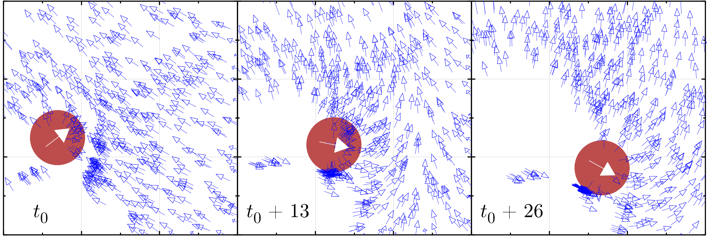

# Swarming SPP
A C++ library for simulations of self-propelled particles and the theoretical study of emergent swarming behaviors.
Currently supports 2D or 3D calculations of particles following the Vicsek consensus with either metric or topological interactions that move either in open space or in a periodic box.



## Installation
To install the spp library on your system, navigate to the `src/` folder and run
```Bash
make install
```
This will compile the code and generate `libspp.h`, `libspp2d.a`, and `libspp3d.a`, and copy them to your installation folder.
The default installation folder is `$(HOME)/bin/`; this folder can be changed by editing the `ROOT` variable on `Makefile`.

To use the libraries, add `#include <libspp.h>` to your code and compile using either `-libspp2d` or `-libspp3d` depending if you want the compute 2D or 3D swarm dynamics. You may need to specify the location of the library with `-Ibin/ -Lbin/` (or the appropiate location where the `.h` and the `.a`s have been installed).

## Description
The spp library includes a collection of classes that model different aspects of self-propelled particles dynamics where each particle follows an arbitrary rule for the evolution of its velocity. This rule is also commonly refer to as "behavior" or "protocol."

Classes included:
*   __Community__: [[src/community.h](src/community.h)] Handles a collection of `Agent` instances. Controls the dynamic of the swarm and computes its statistical properties such as mean values, order parameter, and correlations. Some models for swarm dynamic may require to expand on this class.
    *   __HostileEnvironment__: [[src/community.h](src/community.h)] Extension of Community to handle systems containing two kinds of agents: predators and preys. Both are `Agent` instances, but with different behaviors.
*   __Agent__: [[src/agent.h](src/agent.h)] Describes one self-propagating agent perfoming multi-agent consensus. Mostly a placeholder for ease of use, the algorithms for the consesus protocol are defined by the `Behavior` class.
*   __Behavior__: [[src/behavior.h](src/behavior.h)] Abstract class that contains the rule describing how an agent updates its velocity at each time step given the state of the other agents in the swarm. This is the "model" of the swarm dynamics. Each behavior relies on a `Interaction` instance to decide which agents' information it will use for the update rule (i.e. which agents are "neighbors").
    *   __Vicsek_consensus__: [[src/behavior.h](src/behavior.h)] Behavior implementation of the Vicsek model for heading consensus. At each time-step one agent aligns to the mean heading of its neighbors.
    *   __Chate_consensus__: [[src/behavior.h](src/behavior.h)] Same as Vicsek model but with "vetorial" noise, i.e. the noise is a vector added to the consensus speed instead of a rotation of it.
    *   __Vicsek_prey__: [[src/behavior.h](src/behavior.h)] Vicsek model with an added layer of predator avoidance (the agents flee if a predator is near, otherwise perform Vicsek consensus).
    *   __Vicsek_predator__: [[src/behavior.h](src/behavior.h)] Vicsek model with an added "hunt" method that makes the predator chase the closest prey.
*   __Interaction__: [[src/interaction.h](src/interaction.h)] Abstract class that contains the rule to determine which agents are neighbors of which. No symmetry is assumed (A can be neighbor of B with B not a neighbor of A). Each interaction has a `Geometry` instance to determine how to compute the displacement and distance between agent in case it is needed to determine neighborhood.
    *   __Metric__: [[src/interaction.h](src/interaction.h)] `Interaction` implementation of the metric interaction: A is a neighbor of B if the distance between A and B is smaller or equal to a certain interaction radius R.
    *   __Topologic__: [[src/interaction.h](src/interaction.h)] `Interaction` implementation of the topological interaction: the neighbors of a given agent are its k closest agents. In network lingo, this interaction has a fixed outdegree.
*   __Geometry__: [[src/interaction.h](src/interaction.h)] Abstract class with the rule to compute the displacement (vector) and distance (scalar) between agents.
    *   __Cartesian__: [[src/interaction.h](src/interaction.h)] Euclidean geometry with no boundary. The displacement is the vector difference of positions, the distance is the norm of that vector. Easy stuff.
    *   __CartesianPeriodic__: [[src/interaction.h](src/interaction.h)] Euclidean geometry with periodic boundary conditions in a fixed-size cube.
*   __Grid__: [[src/grid.h](src/grid.h)] Class to store "Verlet lists" with information on the coarse location of each agent, so that agents only looks for neighbors in their local "neighborhood." To use in conjuction with a `Community` instance via `Community::setup_grid(*Grid)`. Using a Grid will speed up calculations with large number of agents considerably at the cost of increasing the memory used.

The library follows a matryoshka structure: the `Community` contains an array of `Agent`s. Each `Agent` has a `Behavior`, which in turn has an `Interaction` that depends on the `Geometry` provided.

## Using the library
For most applications, the interaction with this library will be almost exclusively through the `Community`class provided. This class is capable of operating a group of self-propelling particles efficienctly and to compute a series of different statistical properties of the collective, such as the correlation or the order parameter. The fastest way to build a `Community`is by using the `spp_community_autostart` function. This function requires the number of agents to create, the speed at which these agents should start, the size of the computation box and a behavior for the agents, given as a `Behavior` instance.
For example, one can create a community of 1000 agents following the Vicsek's model with metric interaction, moving in a periodic flat space by running:
```C++
#include <libspp.h>
int num_agents = 1000 ;
double box_size = 10. ;
double interaction_radius = 1.0 ;
double speed = 0.2 ;
double noise = 0.1 ;
CartesianPeriodic g = CartesianPeriodic( box_size ) ;
Metric interaction = Metric( interaction_radius , &g ) ;
Vicsek_consensus behavior = Vicsek_consensus(&interaction, speed, noise) ;
Community com = spp_community_autostart( n_agents , speed, box_size, &behavior ) ;
```
Most self-propelled particle dynamics models consider an iterative procedure where all the agents move synchronously and then all update their velocities, also syncrhonously. With a `Community` instance `com`, one can write
```c++
int n_iterations = 5000 ;
double deltat = 1.0 ;
double* v2 = spp_community_alloc_space( n_agents /*number of agents in com*/) ; // Space to store temporary data
// Main loop
for(iter=0; iter< n_iterations; iter++){
  com.periodic_move( deltat) ;
  com.sense_noisy_velocities(v2) ;
  com.update_velocities(v2) ;
}
```

## Running the examples
See [`examples/README.md`](examples/README.md).
